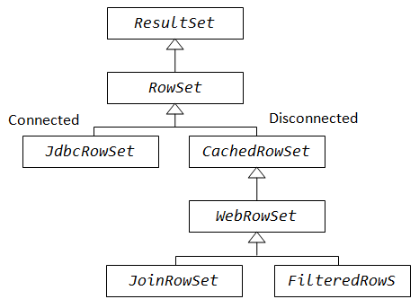

I. java.sql core API 
 Most important interfaces are: 
   [DriverManager,Connection,Statement,PreparedStatement,
    CallableStatement,ResultSet,ResultSetMetadata,DatabaseMetadata]
    
    Connection conn = DriverManager.getConnection(dbUrl,username,pwd);
    Statement stmt = conn.createStatement();
    ResultSet rs = smt.exxecuteQuery("SELECT * FROM tableName);
 A. interface ResultSet :
  It models the result table of an SQL SELECT query. 
  It maintains a row cursor ,initially positioned before the first row.
  The default ResultSet object is not updatable and its row cursor moves only forward.
   # interface Connection
    Statement createStatement(int rsType,int rsConcurrency,itn rsHoldability)
                throws SQLEXception
   # ResultSet Types
    ResultSet.Type_FORWARD_ONLY :The rs is not scrollable,moves only forward
    ResultSet.Type_SCROLL_INSENSITIVE:The row cursor can move forward,backward,toabsolute or relative rows ,via : 
                first(),last(),previous(),next(),absolute(int),relative(int),beforeFirst(),afterLast(),
                moveToInsertRow(),moveToCurrentRow()    
    ResultSet.Type_SCROLL_SENSITIVE :The rs reflects changes made to the underlying data source by others while
                        it remains open.

  # ResultSet Concurrency
    ResultSet.CONCUR_READ_ONLY:The rs object is read-olny, ie non-updatable
    ResultSet.CONCUR_UPDATABLE:ResultSet is updatable using appropriate updateXXX() methods

 # ResultSet Holdability :Behavior of rs cursors 
    ResultSet.HOLD_CURSORS_AT_COMMIT:
    ResultSet.CLOSE_CURSORS_AT_COMMIT:
 
 B.interface DatabaseMetadata 
    
    
III. package javax.sql.rowset 
 There are 2 types of rowsets :[connected ,non-connected]

 
    JdbcRowSet: A conncted Rowset , as awrapper to a scrollable & updatable ResultSet
    CachedJdbc:Defines the basic capabilities of a disconnected rowset, which can re-connect
               to the data source to update the changes while disconnected
    WebRowSet:
    JoinRowSet:
    FilterRowSet: