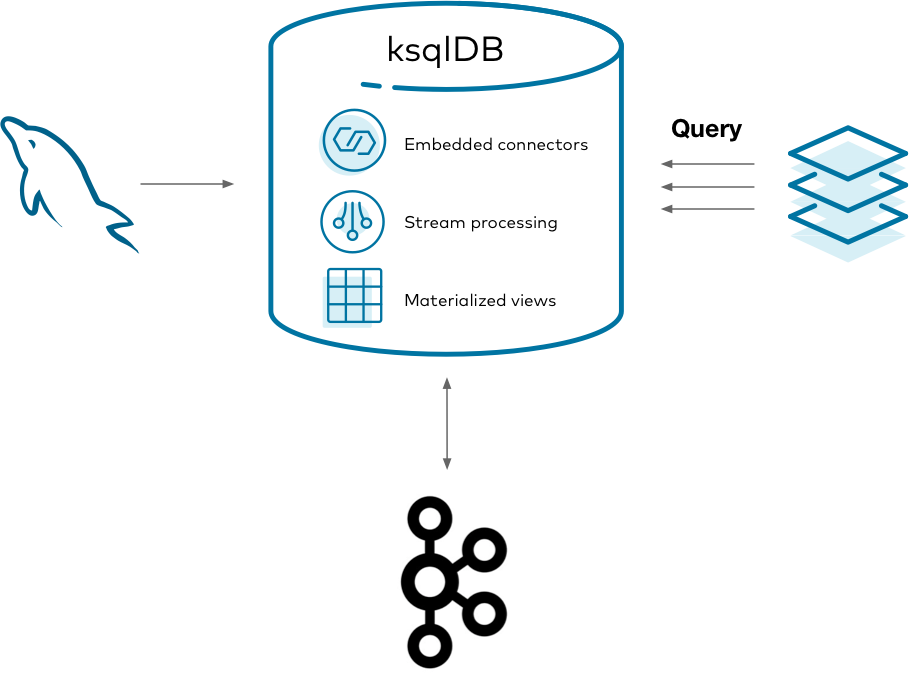
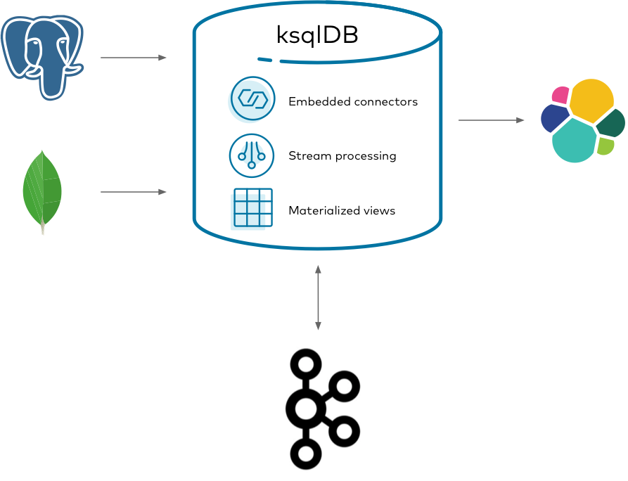

    I.Materialized Cache [materialized View]
 A.Introduction
 It is an approach to precomputing the results of an KsqlDB query & storing them for
fast read access.
Contrary to regular db queries which hdo the work at read time,materialized views do most of 
their work at write-time.
 Capturing the changelog of a database and process it as a stream of events,enables us to create 
multiple materializations each servicing different query patterns for our application.
  # Workload
 A company with a call-center and people regulary calling about a product,to ask for a refund or for
other reasons.The volume of calls is high ,thus we create a set of materialized views about phone calls made.
 We need to :
 # capture changes from a MySQL database,forward them into Kafka ,create materialized views
 # with KsqlDB and query them from other apps.In particular:
    1.Capture the changelog of a Mysql database using Debezium connector
    2.The changelog is stored in Kafka and processed as a stream proceesor
    3.The materializations are updated in Redis so that apps can query them.

 Managing databases,clusters for kafka,connectors,stream processors is a lot. 
Managing,scaling and securing all these systems as one is cumbersome.
 KsqlDB comes as a resque ,slimming down the architecture to 2 things : [Storage (kafka),Compute (KsqlDB)]

 
 # Get the Connectors
    $cd & mkdir confluent-hub-components
    $confluent-hub install --component-dir confluent-hub-components --no-prompt \
        debezium/debezium-connector-mysql:1.1.0
 Next, we set up a docker-compose.yml file consisting of the following services:
    [mysql,zookeeper,broker,schema-registry,ksqldb-server,ksqldb-cli]
 Before starting the stack we create a configuration file  located at
  # mysql/custom-config.cnf
    [mysqld]    
    server-id
    log_bin                  = mysql-bin
    binlog_format            = ROW
    binlog_row_image         = FULL
    expire_logs_days         = 10
    gtid_mode                = ON
    enforce_gtid_consistency = ON

   

 B.Implementation
 1.A database call-center with a table calls [name,reason,duration_seconds ] is to be created in MySQL.
   We add data to the table accordingly
 2.The Debezium source connector calls-reader is used to stream MysQL's changelog into a Kafka topic 
  [call-center-db.call-center.calls]
 3.Create a stream :calls over the changelog topic the Debezium source connector created
 4.Create the following 2 Materialized Views :
  (i)support_view :Keeps track of the distinct number of reasons a caller called.
  (ii)lifetime_view:Lifetime behavior of each caller.
 5.Finally, query the materialized views

    $docker-compose up # Bring up the stack
    $docker exec -it mysql /bin/bash # Start MySQL(execute command in a running containter) 
    mysql>USE call-center;
    mysql>CREATE TABLE IF NOT EXISTS calls(name TEXT,reason TEXT,duration_seconds INT);
    mysql> INSERT INTO calls(name,reason,duration_seconds) VALUES ("michael", "purchase", 540);
    mysql> INSERT INTO calls (name, reason, duration_seconds) VALUES ("michael", "help", 224);
        ("colin", "help", 802),("derek", "purchase", 10204),("derek", "help", 600),
        ("colin", "refund", 105),("michael", "help", 2030),("colin", "purchase", 800),
        ("derek", "help", 2514),("derek", "refund", 325);
    # Connect to Debezium to stream MySQL's changelog
    $docker exec -it ksqldb-cli ksql http://ksqldb-server:8088--Connect to ksqldb-server using ksqldb cli
    ksql>SET 'auto.offset.reset'='earliest';
    ksql>CREATE SOURCE CONNECTOR calls_reader WITH (
        'connector.class' = 'io.debezium.connector.mysql.MySqlConnector',
        'database.hostname' = 'mysql','database.port' = '3306',
        'database.user' = 'example-user','database.password' = 'example-pw',
        'database.allowPublicKeyRetrieval' = 'true',
        'database.server.id' = '184054','database.server.name' = 'call-center-db',
        'database.whitelist' = 'call-center',
        'database.history.kafka.bootstrap.servers' = 'broker:9092',
        'database.history.kafka.topic' = 'call-center',
        'table.whitelist' = 'call-center.calls','include.schema.changes' = 'false);
    ksql>SHOW TOPICS;
    ksql>PRINT 'calls-center-db.call-center.calls' FROM BEGINING;
    ksql>DESCRIBE CONNECTOR calls_reader;
    ksql>CREATE STREAM IF NOT EXISTS call WITH (
           kafka_topic='call-center-db.call-center.calls',value_format='avro');
    --Create the Materialized views
    ksql>CREATE TABLE IF NOT EXISTS support_view AS SELECT
           after->name AS name, COUNT_DISTINCT(after->reason) AS last_reason,
   
    Ksql>CREAT TABLE IF NOT EXISTS lifetime_view AS SELECT 
            after->name AS name,COUNT(after->reason) AS total_calls,
            SUM(after->duration_seconds)/60 AS minutes_enganged 
         FROM calls GROUP BY after->name EMIT CHANGES; 

         II. Streaming ETL pipeline
 It is a set of software services that ingests events, transforms them and loads them into destination storage
systems.
 Streaming ETL pipelines enable streaming events between arbitrary sources and sinks ,helping us make changes to 
the data while it's in flight.
 # Workflow
 A retail company sells and ships orders to online customers.The goal is to analyze the shipment activity
of orders in real-time.
 There is available data for customers ,orders and shipments which are spread across different source systems.We
need to capture changes from Postgres & MongoDB  databases ,forwarding them to kafka & joining them together.
Finally the processed data streams are to be sinked to ElasticSearch for further analytics.

    1.Capture teh changelogs of upstream MongoDB and Postgres databases using
      Debezium Kafka connectors.  
    2.The changelogs are stored in Kafka and are to be processed.programs transofrm,
      aggregate and join the data together.
    3.The processed (transformed) data are streamed out to ElasticSearch for indexing.

 With KsqlDB we can run any Kafka Connect Connector by embedding it in the KsqlDB's servers.
 # A.Get the connectors 
    $cd
    $confluent-hub-install --component-dir confluent-hub-components --no-prompt \
        debezium/debezium-connector-postgresql:1.1.0
    $confluent-hub-install --component-dir confluent-hub-components --no-prompt \
        debezium/debezium-connector-mongodb-1.1.0
    $confluent-hub-install --component-dir confluent-hub-components --no-prompt \
        confluentinc/kafka-connect-elasticsearch:10.0.1
 # B.Create a docker-compose.yml file containing the following services:
  [mongo,postgres,elastic,zookeeper,broker,ksqldb-server,schema-registry,ksqldb-cli]
  
    $docker-compose up -d # Start the stack
    $

       III. Event-Driven microservice
 It is a pattern in which a piece of code only communicates with the outside world through events,messages.
Each microservice only receives & emits info from clearly defined communication channels which 
greatly simplifies the architecture.
 Notice that state is localized within each microservice, complexity is contained.
 
 # Workflow
 A financial services company clears many credit card transactions every day.We need to prevent malicious
activity 
 If a high number of transactions occurs in a narrow window of time, we must notify the cardholder of a 
potential malicious activity.
 Goal: Create an event-driven miocroservice that identifies suspicious activity & notifies the customers.
It involves finding anomalies with KsqlDB and sending alert emails using a Kafka Consumer with [SendGrid]
 1.Setup the stack & bring it up.Connect to the KsqlDB server & create a stream of credit card transactions.
  called transactions :[tx_id,email_address,card_number,timestamp,amount]
  We are performing time processing ,therefore the stream is created using a custom timestamp column for 
measuring time (instead of processing time) enforcing ecvent-time semantics.
 Moreover the stream is configured to use Avro serialization format and the schema of the stream is tracked
centrally ,as KsqlDB runs with Schema Registry.
 2.Seed some transaction events & create a table called possible_anomalies
  We use a table as we need to model aggregations over time.
  30 seconds tumbling windows for each credit card number 
 