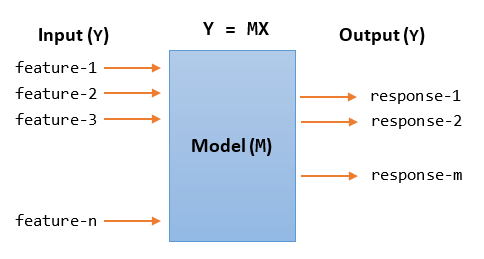

    Machine Learning
 Main focus of ML is to develop algorithms that build models on data and make predictions
 The Data Analysis process consists of the following:
 1.Problem identification and definition
 2.Data preparation,ie gathering ,extraction,cleaning and data transformation
 3.Data exploration and visualization
 4.Predictive modeling:Construct classification (categorical data) ,regression (numerical data) or clustering
   models (descriptive data).
 5.Model validation and testing
 6.Deployment and interpretation of the predictive results

 A.Terminology

 Data is organized in 2D tables where each column is a feature or a response and each row is an observation,
an instance or record  
 Features: Theya are also known as attributes,predictors, repressors, independent variables;they are inputs to 
the model.
 Response: Is the output to the model and represents the outcome we want to predict.It is also known as 
target,dependent variable,output,outcome
 Data is split into training set and test set for building the model and evaluating (testing) the model respectively
 Types of data :
 1.Categorical Data
   Nominal :They do not have any intrinsic order (eq category A,B,C...) 
   Ordinal:They have a predetermined order (eq band 1,2,3)
 2.Numerical Data
    Discrete : They can be counted with distinct values
    Continuous:
 Raw Data Formats: The following types are included :
    CSV,JSON,HTML,XML,SQL,HDF etc
 Types of Machine Learning
 1.Supervised Learning :The data consists of input features and the output target that we want to predict
      Classification :The output response is categorical,belonging to >=2 catgories
      Regression:The output target is continuous and ordered.
 2.Unsupervised Learning:The data doesn't contain any response values
      Clustering:Grouping similar inputs into classes (clusters)
      Dimensionality Reduction:Reducing dimensions of the inputs with the goal that the lower 
      dimesnionality of the outputs will convey much more info
 3.Semi-Supervised Learning: