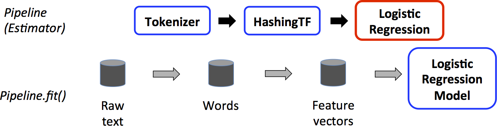

  			ML Library [org.apache.spark.ml] package
 It covers the following topics:

  ML Algorithms :Classification,Regression,Clustering,collaborative filtering 
  Featurization :Feature extraction,transformation,dimensonality reduction,feature selection
  Pipelines:Constructing,evaluating and tuning ML pipelines
  Persistence:Saving & loading ml algorithms ,models and Pipelines
  Utilities:Linear Algebra,statistics,data handling 

 A.Data Types ## org.apache.spark.ml.linalg
  Vector: Represents a numeric vector whose index types is Int and value type is Double
  Matrix

  class Vectors

  	static Vector dense(double[] val,),dense(double v1,..double v2,..), dense(double v1,scala.collection.Seq<Object> )
  		        sparse(int sz,int[] indices,double[] values)
  		        zeros(int sz), norm(Vector v,double p)
  		        sqdist(Vector v1,Vector v2)

 class Matrices

 	static Matrix dense(int nrows,int ncols,double [] values)
 				sparse(int nrows,int ncols,int[] indices,int[]colParts, rowIndices,double [] values)
 				zeros(int nrows,int ncols), ones(int nr,int nc),rand(int nr,int nc,Random r),randn()
 				eye(int n),speye(int n),

 B.Data Sources
 	
 	Sources			Options
 	Image source :  origin (StringType),height(IntegerType),width(IntegerType)
 					nChannels (IntegerType),mode(IntegerType)
 					data (BinaryType)
    LIBSVM          label (DoubleType),features (VectorUDT)

The ImageDataSource implements Spark SQL data source API for loading image data from a directory as a DataFrame 
The LibSvmDataSource implements Spark SQL data source API for loading LIBSVM data as DataFrames

 C.Pipelines

 ML Pipelines provide a uniform API built on top of DataFrames, helping us to combine multiple ML algorithms into 
 a single pipeline or workflow.
 The API is inspired by the [scikit-learn] project.
 The main components are:

 	DataFrame:It is uses as a Spark ML dataset which can hold a variety of daa types
 	Transformer:Is an ML algorithm which transforms a DataFrame into another DF .
 	It is an abstraction that includes :Feature Transformers & Learned Models
 	  Feature Transformer:It might take a DF->read a column->map it into a new column->output a new DF with the mapped 
      column appended
 	  Learned Model:Might take a DF->read a column containing feature vectors->predict the label of each feature 
       vector->output a new DF with the the predicted labels appended
 	Estimator:Abstracts the concept of a learning algorithm that fits or trains the data
 			 It implements method fit() which produces a Model ,ie a Transformer 
 	Pipeline:Chains multiple Transformers and Estimators together to specify an ML workflow.
 	Parameters: A named parameter with self-contained documentation that is used by Estimators and Transformers
 	  ParamMap is a set of (parameter,value) pairs
 	 Either set parameters for an isntance ,using setXxx() methods or pass a ParamMap to fit() or transform()
 A Pipeline is specified as a sequence of stages ,each of them being either a Transformer or an Estimator
Let's consider a simple text workflow composed of 3 stages :

The Tokenizer.transform() Transformer splits the document into words adding a new  column with the words
The HashingTF.transform() Transformer transforms the words into a feature vector adding a new column with 
these vectors.
The LogisticRegression is an Estimator ,and thus the Pipeline calls first LogisticRegression.fit()-> 
producing a LogisticRegressionModel
If the Pipeline had more Estimators, it would first call LogisticRegressionModel.transform() before moving 
 to the next stage of Estimator
After calling Pipeline's fit() -> a PipelineModel is produced,which is a Transformer that is used at test time
The PipelineModel has all the stages that the Pipeline has, but the Estimators have become Transformers.When
calling PipelineModel.transform() onm a test dataset ,the data are passed through the fitted pipeline in order
so that each stage's transform() updates the dataframe and passes it to the next stage.
 Pipelines are specified as an ordered array. It is ok to define non-linear Pipelines as long as the data flow 
graph forms a Direct Acyclic Graph, in which case the stages must be specified in topological order

 D.ML Hyper-parameter Tuning:[CrossValidator,TrainValidationSplit]
 Model Selection or hyperparameter tuning is an important task in the ML process and involves finding
 the best model or parameters for a given task .We need the following components : 
    Estimator:ML Algorithm or a Pipeline to tune 
    Evaluator:Metric on how well the  fitted Model does on the held-out data.The types are: 
     BinaryClassificationEvaluator, MulticalssClassificationEvaluator,RegressionEvaluator,
     RankingEvaluator
 Workings of the model selection tools:
 1.Split the dataset into training and test data.
 2.For each (training,test) pair of datasets they iterate through the set of ParamMaps: 
      For each ParamMap they fit an Estimator using these parameters,get the fitted Model and 
      evaluate the Model using the Evaluator. 
3.Then ,they select the best Model ,the one produced with the best parameters
Use a org.apache.spark.ml.tuning.ParamGridBuilder to construct the grid of parameters.
 
 TrainValidationSplit evaluator splits the dataset into training and testing parts using a 
[trainRatio] and evaluates the set of parameters only once.
 CrossValidator split the dataset into k folds that are used as seperate training and test pairs.
So,for a k=3 folds => CrossValidator creates 3  (trainning, test) dataset pairs each of which
a trainRatio of the data for training and for testing 
Evaluating a particular ParamMap it computes the average evaluation metric from the 3 Models 
produced by fitting the Estimator on the 3 (training,test) pairs 
Finally, CrossValidator re-fits the Estimator using the best ParamMap and the entiore dataset

