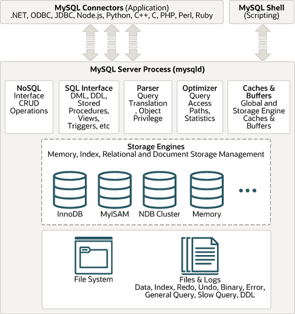

A. MySQL Architecture

 MySQL follows the client-server architecture which divides the system into 2 components:[Client,Server]
 (i)Client
    The client is tha app that interacts with the MySQL db server
    The client sends SQL queries to the MySQL Server for processing 
    It can be a standalone app, a web app or any program that needs a database
 (ii)Server
    It is the MySQL db system responsible for storing ,managing and processing data
    It receives SQL queries ,processes them and returns the result sets
    it manages multiple clients' data storage,security & concurrent access
 Start & Stop processes
 #
 $sudo systemctl start mysql
 $sudo systemctl stop mysql 
 $sudo systemctl {restart|status|stop|start} mysql

